# SIMS AI — Smart Informal Business Management Ecosystem

[](https://github.com/gurupirataurai92-wq/MetaEditor5-/actions/workflows/ci.yml) [](LICENSE)

**An offline-first, AI-augmented, multi-currency business-management platform engineered for Zimbabwean informal and small-to-medium enterprises.**

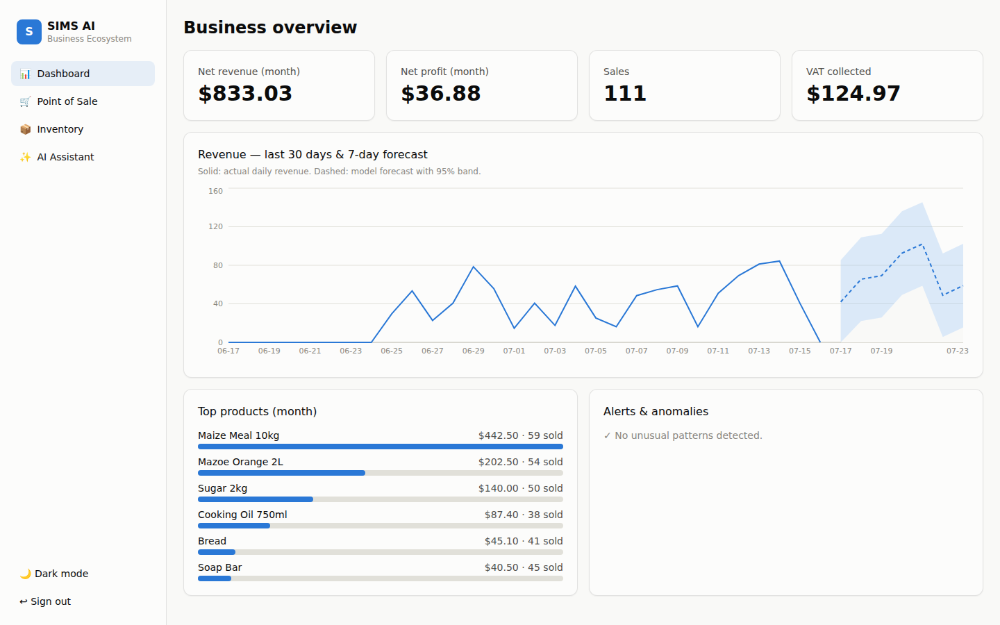

SIMS AI modernises small businesses through automation, analytics and digital
finance — designed from first principles for Zimbabwe's realities: intermittent
connectivity and power, ZiG/USD multi-currency volatility, and mobile-money-first
payments (EcoCash, OneMoney, ZIPIT, PayNow).

## What's in this repository

| Directory | Contents | Status |
|---|---|---|
| `backend/` | FastAPI modular monolith — identity/RBAC, inventory, POS, finance, sync engine, analytics/AI, **online store** | ✅ Working, 61 passing tests |
| `web/` | React + TypeScript + Tailwind admin dashboard (dark mode, charts, POS, AI assistant) | ✅ Working, builds clean |
| `mobile/` | Flutter offline-first app (SQLite replica, Lamport outbox, idempotent sync) | 🧩 Working skeleton |
| `ml/` | Forecast training + rolling-origin backtest harness (MAPE/RMSE/MAE) | ✅ Runnable, zero-dep baseline |
| `infra/` | Docker Compose (Postgres + Redis + API + NGINX), row-level-security SQL | ✅ Deployment-ready |
| `docs/research/` | **Full university dissertation** — Chapters 1–7 + IEEE references + Mermaid diagrams | ✅ Complete draft |
| `docs/manuals/` | User Manual, Administrator Manual, Installation Guide | ✅ Complete |
| `scripts/` | `seed_demo.py` — one command to populate a rich demo business | ✅ Runnable |

## The three engineering contributions

1. **Transaction-time multi-currency capture.** Every monetary event stores
   `(amount, currency, base_currency, exchange_rate, rate_source)` as exact
   decimals — a sale made at ZWG→USD 0.037 keeps its economic meaning after
   any devaluation. Reports convert with the *captured* rate, never today's.
2. **Offline-first sync that cannot lose or double-count money.** Sales and
   stock movements are immutable, client-UUID-keyed events (union-merge +
   dedupe = idempotent retries); master data merges last-writer-wins on
   Lamport clocks; two offline tills selling the same last unit are both
   accepted and flagged for review, never silently dropped.
3. **Grounded AI assistance.** The assistant retrieves the tenant's own
   figures (tenant-isolated at the retrieval boundary) and answers from them —
   an auditable evidence trail ships with every answer. Forecasting, reorder
   points and anomaly/fraud detection run on lightweight, explainable models.

## Open in VS Code

This repo is a ready-to-open VS Code workspace. Clone it and open the folder
(or the `sims-ai.code-workspace` file):

```bash
git clone https://github.com/gurupirataurai92-wq/MetaEditor5-.git sims-ai
cd sims-ai
code sims-ai.code-workspace      # or: code .
```

VS Code will offer the recommended extensions (Python, Ruff, Tailwind,
Flutter). Then either:

- **One command:** run `bash scripts/dev.sh` — it sets up the backend, starts
  the API + dashboard, seeds demo data, and prints the three logins; or
- **Built-in tasks** (`Terminal → Run Task…`): *SIMS: install backend*,
  *SIMS: run backend*, *SIMS: run web dashboard*, *SIMS: seed demo data*; or
- **Debug** (`Run and Debug`): *SIMS AI — Backend API* / *Backend tests*.

## Quick start (development)

```bash
# Backend (SQLite dev mode — Postgres via SIMS_DATABASE_URL for prod)
cd backend
python3 -m venv .venv && .venv/bin/pip install -r requirements-dev.txt
.venv/bin/python -m pytest -q          # 51 tests
.venv/bin/uvicorn app.main:app --reload  # OpenAPI docs at /docs

# Web dashboard (proxies /api to localhost:8000)
cd ../web
npm install && npm run dev

# ML evaluation harness
python3 ml/train_forecast.py
```

With the backend running, seed a fully-populated demo business (six weeks of
sales, rates, expenses, anomalies) and log in with the printed credentials:

```bash
python3 scripts/seed_demo.py
```

The seed prints three logins — **owner**, **manager** and **till operator** —
sign in with each to see the three role-adaptive workspaces.

## Production deployment

```bash
cd infra
SIMS_JWT_SECRET=$(openssl rand -hex 32) POSTGRES_PASSWORD=... docker compose up -d
```

One VPS runs the whole stack: NGINX serves the dashboard and proxies the API;
PostgreSQL enforces tenant isolation with row-level security on top of the
application-layer RBAC.

## Three workspaces, one login (role-adaptive UI)

The same login screen routes each role to its own dashboard, driven by the
permission grants inside the JWT (and enforced again server-side + by
row-level security):

- **Owner — full access.** Lands on the financial Dashboard; additionally
  gets **Branches** (open new shops, see staffing per branch), the **Live
  Monitor** (god-mode till surveillance), and everything the manager sees —
  with the power to change it.
- **Manager — staff & stock.** Lands on **Staff & Duty**: hire employees
  (each types their *own confidential password* at hiring — stored as an
  Argon2 hash, unreadable to anyone), assign them to branches, clock them
  on/off duty; plus Inventory and the Live Monitor. No branch creation,
  no owner financials.
- **Till operator — serve customers.** Lands on the Point of Sale: sell,
  take payments, add/retire products, and get a **printable receipt slot**
  after every sale. Only ever sees their own receipts. No reports, no
  staffing, no void button.

### Branch-aware "god mode"

Every sale and stock movement is stamped with the operator's **branch**, so
the owner drills all the way down:

- **Finance & inventory per branch.** A branch selector on the Dashboard,
  Inventory and Live Monitor filters every figure to one shop; the Dashboard
  also shows a **performance-by-branch** table (revenue / net profit / sales
  per branch) for the whole-business roll-up.
- **Owner** can open *and close* branches, and hire *or remove* staff.
- **Manager** can hire/remove staff and **update goods prices** inline, but
  cannot open/close branches or see owner financials.
- **Payments editor.** Owner/manager/accountant can **correct a recorded
  payment** after the fact (it was EcoCash, not cash) — every edit audited.
- **Per-till-operator history.** Filter sales history by operator to review
  exactly what each till rang up.

| Owner: branch-aware dashboard | Owner: payments editor |
|---|---|
| 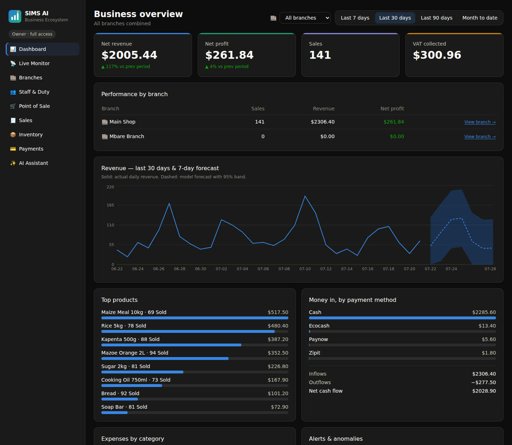 | 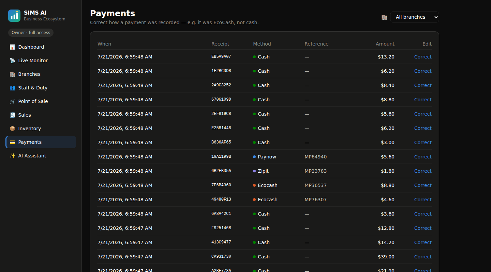 |
| Manager: Staff & Duty | Till operator: receipt slot |
| 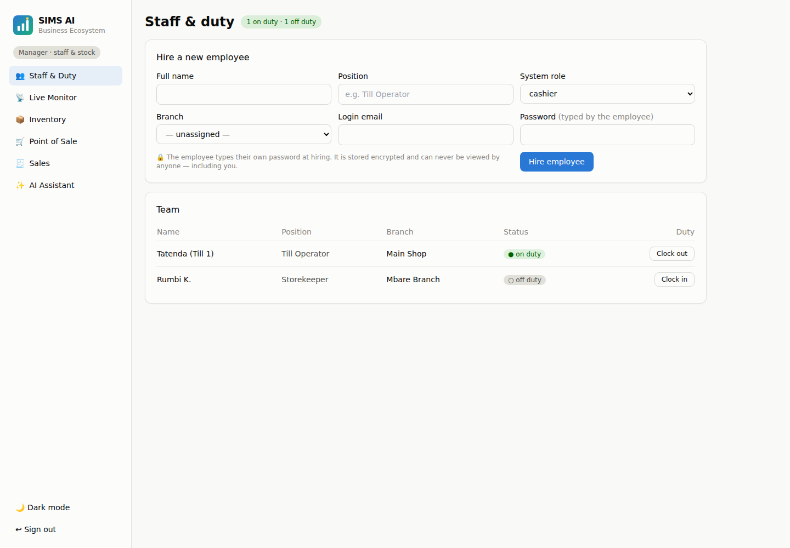 | 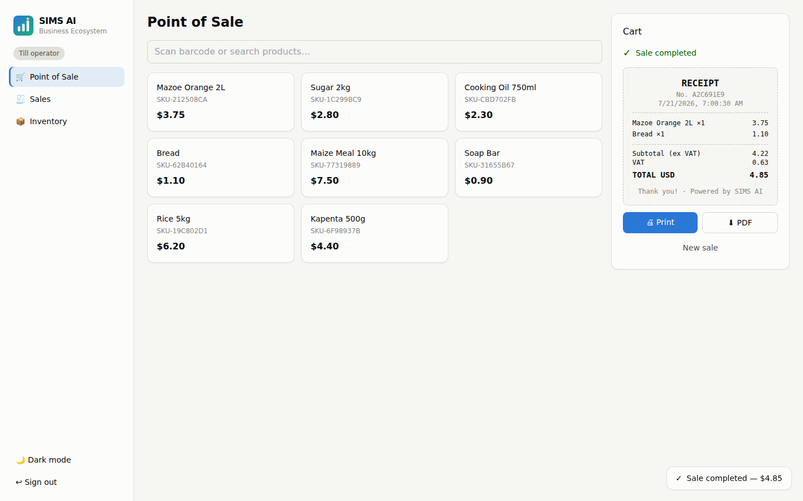 |

## Online store (customers order from home)

Every business gets a **public storefront** — no login for customers. Share
the link (`/?store=<businessId>`, one click from Branches or Online Orders)
and customers browse the catalogue, adjust quantities, choose **delivery or
pickup** and a **mobile-money method**, and place an order.

Orders land in the staff **Online Orders** page (owner/manager/till operator):
**pending → confirmed → fulfilled**, where *fulfilling* replays the order
through the same engine as an in-store sale — so it flows into finance and
per-branch inventory automatically. Prices and VAT are always computed
server-side (a tampered client can't set its own price).

| Customer storefront | Staff order management |
|---|---|
| 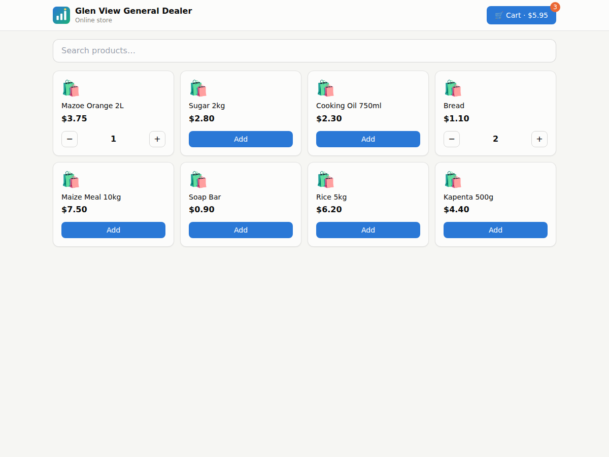 | 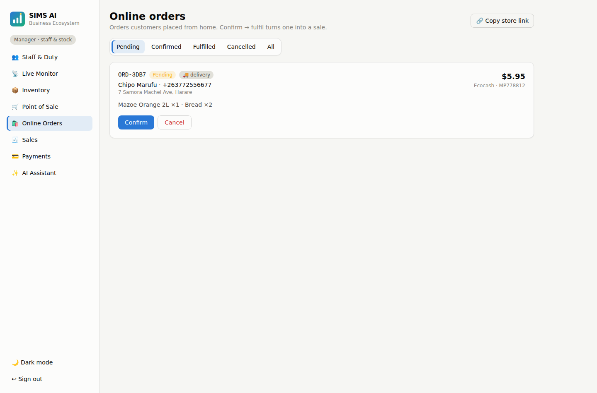 |

## Feature highlights

Multi-shop tenancy · JWT + rotating refresh tokens + TOTP 2FA · role-based
access control (owner/manager/cashier/storekeeper/accountant) · POS with an
editable cart side-panel (per-line quantity steppers, remove, clear), a
quantity picker on product click, and a **camera barcode reader** (native
BarcodeDetector with USB/manual fallback) · a **required product code** on
every new product (scan or type), unique per business · VAT-inclusive ZIMRA
tax extraction ·
split-currency payments (part USD cash, part ZWG EcoCash) · loyalty points ·
PDF receipts (dependency-free generator) · P&L, cash-flow and sales reports ·
demand forecast with confidence bands · reorder suggestions (safety-stock
maths) · anomaly detection (revenue outliers, deep discounts, void frequency,
oversell flags) · immutable audit log · delta sync with cursors.

## Dissertation

The complete research write-up lives in [`docs/research/`](docs/research/):
abstract, Chapters 1–7 (introduction, literature review, methodology, design
with full UML/ER/DFD diagrams, implementation, testing & evaluation,
conclusions) and 43 IEEE references. Diagrams are Mermaid and render on GitHub.

| Login | Dark mode |
|---|---|
| 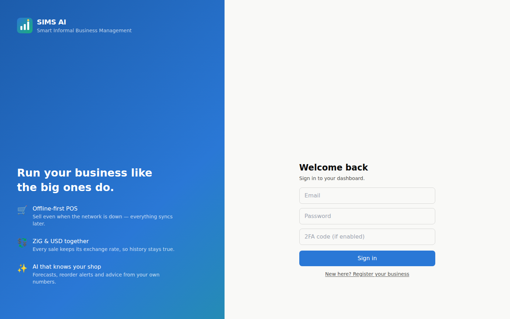 | 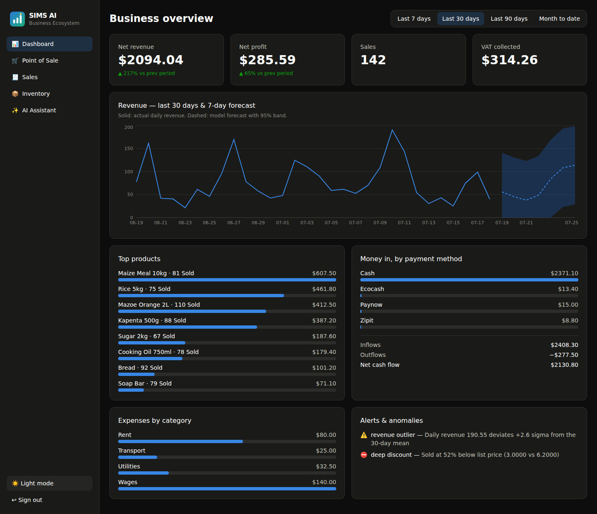 |
| Sales history | Point of Sale |
| 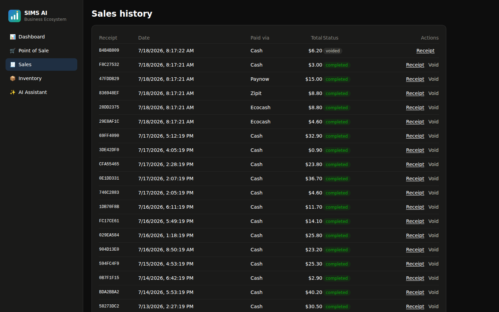 | 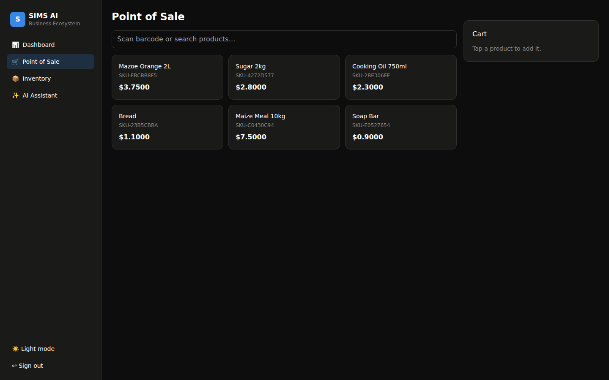 |
