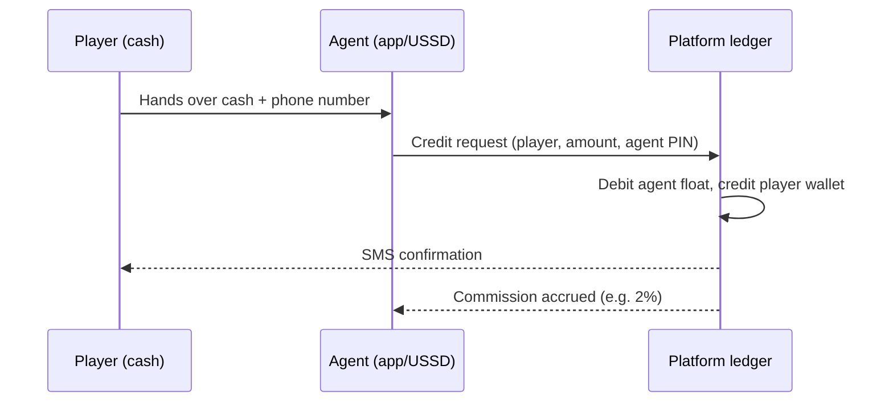
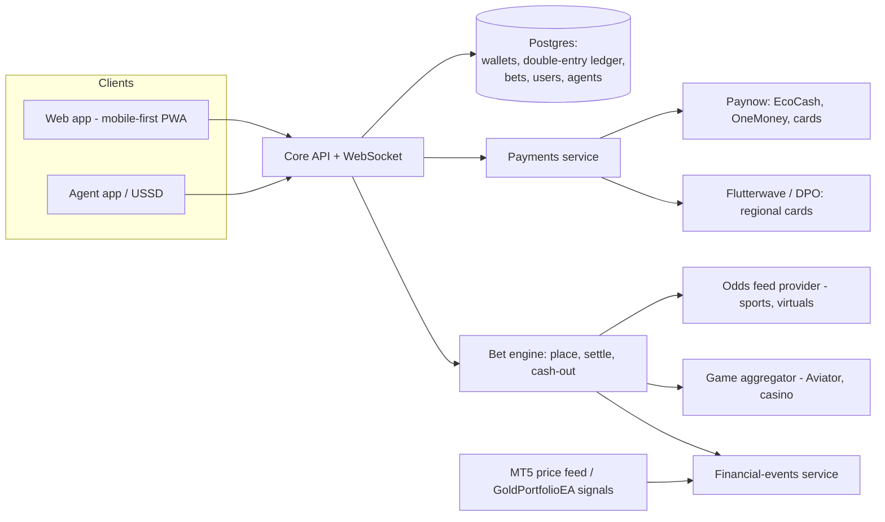

# Betting Platform — Brainstorm & Product Blueprint

> Working document. Target market assumed to be **Zimbabwe / Southern Africa** (based on
> EcoCash and agent-deposit requirements), with room to expand regionally.
> **Important:** operating any real-money betting product requires a gaming licence
> (in Zimbabwe: the Lotteries and Gaming Board) plus KYC/AML compliance. Everything in
> this document should be reviewed with local legal counsel before launch.

---

## 1. Vision

A mobile-first betting platform offering a **portfolio of betting activities** (not just
one product) so different player types each find something they enjoy, with **local
payment rails** (EcoCash, agent cash deposits) that most international betting sites
handle poorly. The existing MT5/GoldPortfolioEA work in this repo gives us a unique
extra category: **financial-market betting** settled automatically from live price data.

Revenue comes from the margin built into each activity (vig, house edge, rake), not from
winning against players on skill.

---

## 2. Activity catalogue — what players can play, and how each makes money

Ordered roughly by expected popularity in the target market.

### 2.1 Sports betting (the anchor product)
- **What:** Pre-match and live betting on football (English Premier League, Champions
  League, and the local Castle Lager Premier Soccer League are the big draws), plus
  cricket, rugby, basketball, boxing.
- **Bet types:** 1X2, over/under goals, both-teams-to-score, handicaps, correct score,
  and **multi-bets/accumulators** — accas are the highest-margin, most popular product
  in African markets.
- **Revenue:** the bookmaker margin ("vig") baked into odds — typically 5–8% per market,
  effectively 20–30% on accumulators.
- **Build note:** don't price odds yourself at first. Buy an **odds feed** (e.g.
  Betradar/Sportradar, BetConstruct, or a white-label sportsbook) and apply your margin.

### 2.2 Aviator-style crash game
- **What:** A multiplier climbs from 1.00x; players cash out before it "crashes". Simple,
  fast, social (everyone sees the same round). Aviator is currently the single most
  popular game across African betting platforms.
- **Revenue:** built-in house edge (~3%) via the crash-point distribution.
- **Build note:** licence an existing certified game (Spribe's Aviator or similar) rather
  than building — provably-fair certification matters for player trust and licensing.

### 2.3 Lucky numbers / lotto betting
- **What:** Bet on the outcome of national and international lottery draws (UK 49s, SA
  PowerBall, etc.) without buying a ticket. Huge in Southern Africa.
- **Revenue:** fixed payout odds set below true probability (house margin 20–40%).

### 2.4 Virtual sports
- **What:** Computer-simulated football leagues, horse/greyhound races with a result
  every 2–3 minutes, 24/7. Fills the gap between real fixtures — important because real
  football is concentrated on weekends.
- **Revenue:** same vig model as sports, but with dozens of events per hour.
- **Build note:** licensed from providers (Golden Race, Kiron — both strong in Africa).

### 2.5 Jackpot / pool betting
- **What:** Predict the outcome of 10–15 selected matches for a small stake; winners
  share a large advertised pool. Cheap ticket, life-changing prize — a proven
  player-acquisition engine (marketing writes itself: "$10,000 jackpot this weekend").
- **Revenue:** rake of 10–30% of the pool; rollovers when nobody wins drive traffic.

### 2.6 Casino games
- **What:** Slots, roulette, blackjack, live-dealer tables.
- **Revenue:** house edge / RTP (slots typically pay out 92–96%, the rest is margin).
- **Build note:** integrate a casino aggregator (one API → hundreds of certified games).
  Never hand-roll RNG casino games — certification (e.g. GLI) is mandatory for licensing.

### 2.7 Financial-market betting — **our differentiator**
- **What:** Fixed-odds bets on market outcomes, settled automatically from our MT5 price
  feed: "Gold up or down by 16:00?", daily over/unders on XAUUSD, "which moves more this
  week: gold or Bitcoin?". Also a **"Beat the Bot"** challenge: the GoldPortfolioEA
  publishes its daily calls and players bet with or against it — nobody else has this.
- **Revenue:** margin on the binary odds (pay 1.85x on a ~50/50 outcome ≈ 7.5% margin).
- **Build note:** this is the one activity we build fully in-house — we already own the
  data pipeline. Settlement is deterministic from recorded ticks, so no disputes.

### 2.8 P2P challenge bets (social layer, phase 2)
- **What:** Players create head-to-head bets against friends ("Highlanders beat Dynamos —
  $5 at even odds"); platform escrows both stakes.
- **Revenue:** 5–10% commission on winnings. Zero house risk.

### 2.9 Esports & specials (phase 2+)
- FIFA/eFootball, Dota, CS2 betting for the younger segment; novelty specials
  (music awards, elections where legal) for social-media moments.

### Player-type coverage check

| Player type | Served by |
|---|---|
| Weekend football fan | Sports betting, jackpots |
| Fast-action player | Aviator, virtuals, casino |
| Dreamer / small-stake | Lucky numbers, jackpot pools |
| Trader-minded | Financial-market betting, Beat the Bot |
| Social bettor | P2P challenges, leaderboards |

---

## 3. Payments — deposits & withdrawals

Local payment friction is the #1 reason African bettors abandon a platform. The mix
below covers smartphone users, card holders, and the large cash economy.

### 3.1 Supported methods

| Method | Deposit | Withdraw | Notes |
|---|---|---|---|
| **EcoCash** (Econet mobile money) | ✅ instant | ✅ | Must-have in Zimbabwe. Integrate via **Paynow** (Zimbabwe's main gateway — one API covers EcoCash, OneMoney, InnBucks, Omari, and cards) rather than direct Econet integration. |
| **Visa / MasterCard** | ✅ | ✅ (slower) | Via Paynow for local cards; add **Flutterwave or DPO Group** for regional/international cards. Card acquirers require the gaming licence before they'll onboard a betting merchant (MCC 7995). |
| **Agent deposits (cash)** | ✅ | ✅ | Our own agent network — see 3.2. Critical for the unbanked/cash economy. |
| **PayPal** | ⚠️ limited | ⚠️ | Honest note: PayPal only permits gambling for **licensed operators in a short list of approved countries**, and PayPal in Zimbabwe is send-only (cannot receive). Treat PayPal as a *later, diaspora-facing* option at best — do not plan the business around it. |
| **Prepaid vouchers** | ✅ | — | Printed PIN vouchers sold through shops/agents; simplest cash on-ramp, no float risk. |
| **USD bank transfer / ZIPIT** | ✅ | ✅ | For larger players; manual review acceptable at low volume. |

Currency: run player wallets in **USD** (standard for Zimbabwean betting operators given
currency volatility), with ZWG accepted at point of payment where the gateway supports it.

### 3.2 Agent deposit network — how it works

Agents (shop owners, airtime vendors) hold a **prepaid float** with us and convert
players' cash into wallet credit:

- Agents **pre-fund** their float (bank/EcoCash) — we never carry agent credit risk.
- Agent earns commission per deposit (1–3%) and optionally on new-player signups.
- Withdrawals reverse the flow: player gets a payout code, agent pays cash, agent float
  is credited back plus commission.
- Needs an **agent app or USSD menu**, per-agent limits, and daily reconciliation
  reports to prevent fraud.

### 3.3 Payment architecture rules

- Every deposit/withdrawal is a **double-entry ledger transaction** (player wallet ↔
  gateway/agent-float account). No balance is ever edited directly.
- Deposits credit only on **gateway webhook confirmation**, never on redirect.
- Withdrawals pass a risk queue: KYC verified, deposits-method match (winnings go back
  the way money came in — an AML standard), velocity checks.
- Wallet-first design: all activities spend from one wallet, so adding a new payment
  method or a new game never touches the other.

---

## 4. System architecture (updated)

Stack default: **Next.js PWA** front end (low-data, works on cheap Android), **Node or
FastAPI** back end, **Postgres** ledger, **Redis** for live odds/WebSocket fan-out.
Third-party for odds, Aviator, virtuals, casino; in-house for wallet/ledger, agent
network, financial-market betting, and P2P.

---

## 5. Compliance checklist (real money — non-negotiable)

1. **Gaming licence** — Zimbabwe Lotteries and Gaming Board (bookmaker licence); licence
   per additional country later.
2. **KYC** — ID verification before first withdrawal; age 18+ gate at signup.
3. **AML** — deposit/withdrawal method matching, transaction monitoring, threshold
   reporting.
4. **Responsible gambling** — deposit limits, self-exclusion, reality checks. Required
   by regulators and the right thing to do.
5. **Game certification** — RNG/crash games must be independently certified; another
   reason to licence Aviator/casino content instead of building it.
6. **PayPal/card scheme rules** — gambling merchants need explicit approval (MCC 7995);
   apply only after the licence is in hand.

---

## 6. Revenue summary

| Activity | Margin mechanism | Typical net margin |
|---|---|---|
| Sports (singles) | Odds vig | 5–8% of stakes |
| Accumulators | Compounded vig | 20–30% |
| Aviator / crash | House edge | ~3% |
| Lucky numbers | Fixed-odds margin | 20–40% |
| Virtuals | Odds vig, high frequency | 8–12% |
| Jackpot pools | Rake | 10–30% of pool |
| Casino | RTP margin | 4–8% of turnover |
| Financial betting | Binary odds margin | 6–10% |
| P2P challenges | Commission on winnings | 5–10% |

Plus agent-network float income and cross-sell (jackpot players → sports → Aviator).

---

## 7. Roadmap

- **Phase 0 — now:** this blueprint; licence application started; company + bank setup.
- **Phase 1 — MVP (play-money or licensed-lite):** wallet + ledger, Paynow (EcoCash +
  cards) sandbox, financial-market betting (fully in-house, our differentiator),
  jackpot pool, leaderboards.
- **Phase 2 — full launch (licence in hand):** sportsbook via odds provider, Aviator +
  virtuals via game providers, agent network pilot (10–20 agents), KYC/AML live.
- **Phase 3 — scale:** casino aggregator, P2P challenges, esports, voucher network,
  second-country expansion, diaspora payments (possibly PayPal where permitted).

---

## 8. Open decisions

1. Real-money from day one (licence first, slower) vs. play-money beta now (validate
   product while licence is processed)?
2. White-label sportsbook (fast, revenue-share) vs. own platform with odds feed only
   (slower, better margins, full control)?
3. Which gateway first — Paynow alone, or Paynow + Flutterwave from the start?
4. Agent network at launch or after digital payments are proven?
