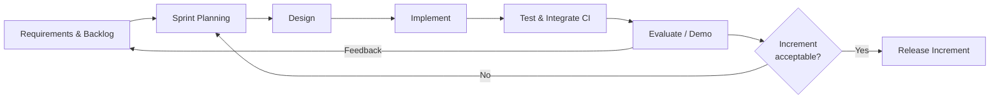
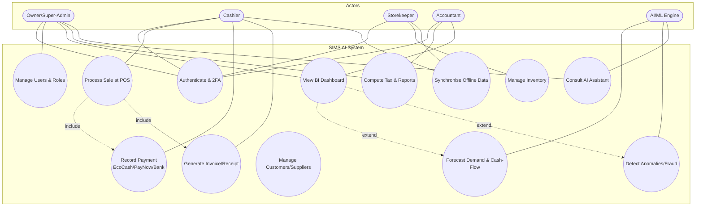
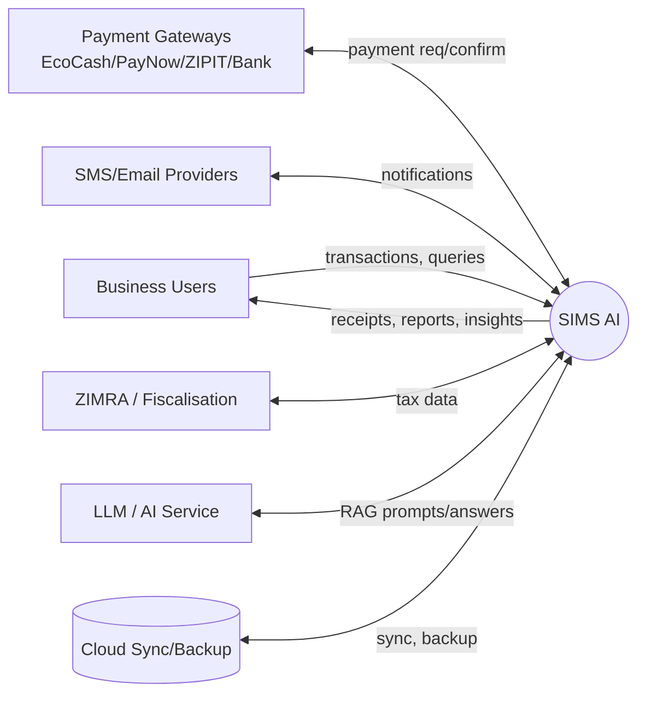
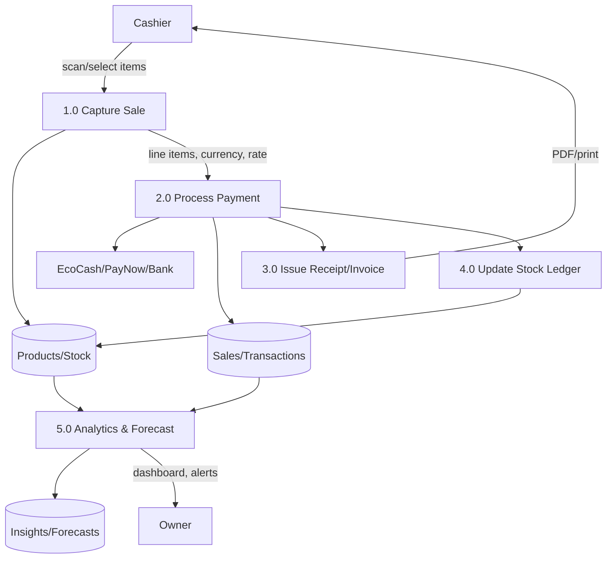

# Chapter 3 — Research Methodology & System Analysis

## 3.1 Introduction

This chapter presents the research philosophy, approach and methods used to investigate the problem and to develop SIMS AI, followed by the system analysis: requirements elicitation, functional and non-functional requirements, feasibility, and the analysis-level models (use cases and data flow). The chapter bridges the "why" of Chapters 1–2 and the "how" of Chapter 4.

## 3.2 Research Philosophy and Approach

The study adopts **pragmatism** as its philosophical stance: the research question — how to build a system that *works* in a specific real-world context — privileges practical consequences over a single epistemology [38]. Consistent with pragmatism, a **mixed-methods** approach combines qualitative requirements elicitation (interviews, observation) with quantitative evaluation (performance benchmarks, forecasting-accuracy metrics, usability scores).

Because the primary output is a designed artefact (the system), the study is conducted within the **Design Science Research (DSR)** paradigm of Hevner et al. [39], which structures research as the iterative *building* and *evaluating* of an artefact that solves a relevant problem, contributing both the artefact and generalisable design knowledge. The DSR guidelines — problem relevance, design as artefact, design evaluation, research rigour, design as a search process, and communication — organise the whole dissertation.

## 3.3 System Development Methodology

An **iterative and incremental (Agile) software-development methodology** was selected over the sequential Waterfall model. The justification is fourfold: (i) requirements in a novel, under-studied domain are emergent and cannot be fully specified up-front; (ii) an offline-first, multi-currency, AI-augmented system carries technical risk best retired through early spikes and continuous integration; (iii) DSR's "design as a search process" maps naturally onto short build–evaluate cycles; and (iv) frequent working increments allow user feedback to shape the artefact. Scrum-style time-boxed iterations were used, each producing a potentially demonstrable increment, with a modular-monolith architecture enabling parallel work across bounded contexts (Identity, Inventory, Sales, Finance, HR, Analytics/AI).

## 3.4 Data Collection Methods

| Method | Purpose | Instrument |
|---|---|---|
| Semi-structured interviews | Elicit pain-points, workflows, currency/payment practices from owners | Interview guide (Appendix A) |
| Direct observation | Capture real POS and stock-keeping workflows in situ | Observation checklist |
| Document analysis | Study existing paper records, receipts, ZIMRA tax guidance | Record templates, statutes [37] |
| Questionnaire / survey | Quantify constraints and technology attitudes (TAM/UTAUT constructs) | Structured survey |
| System Usability Scale (SUS) | Quantitatively evaluate the built artefact's usability | SUS instrument [40] |
| Benchmarking / instrumentation | Measure latency, sync time, forecast accuracy | Automated test harness |

**Sampling.** A **purposive** sample of informal/SME businesses spanning retail, wholesale and services was targeted for elicitation and evaluation, complemented by **representative synthetic datasets** calibrated to observed transaction patterns where longitudinal real data was unavailable (a stated limitation, §1.10).

**Ethics.** Informed consent, anonymisation of business and personal data, secure storage, and the right to withdraw were observed, consistent with the Cyber and Data Protection Act (Ch. 12:07) [36].

## 3.5 Requirements Elicitation and Analysis

Requirements were consolidated from the literature (Chapter 2) and primary data, then prioritised using **MoSCoW** (Must / Should / Could / Won't-for-now). This prioritisation defines the demonstrable vertical core (§1.8).

### 3.5.1 Stakeholders (Actors)

- **Business Owner / Super-Admin** — configures the business, sees all analytics, manages users.
- **Shop Manager** — manages a shop's inventory, staff, reporting.
- **Cashier / Sales Assistant** — operates POS, processes sales and payments.
- **Storekeeper** — receives stock, records movements, stock-takes.
- **Accountant** — reconciles finance, tax, statements.
- **Customer** — receives receipts/invoices, participates in loyalty (external actor).
- **Supplier** — receives purchase orders (external actor).
- **AI Assistant / ML Engine** — system actor generating forecasts, anomalies, advice.
- **Payment Gateways (EcoCash/PayNow/ZIPIT/Bank)** — external systems.
- **ZIMRA / Fiscalisation** — external regulatory system.

### 3.5.2 Functional Requirements (abridged, MoSCoW-tagged)

| ID | Requirement | Priority |
|---|---|---|
| FR1 | Multi-user authentication with JWT, refresh tokens and optional TOTP 2FA | Must |
| FR2 | Role-Based Access Control across all modules and API endpoints | Must |
| FR3 | Multi-shop (multi-tenant) support with per-tenant data isolation | Must |
| FR4 | Inventory: products, categories, stock levels, batches, expiry, barcodes | Must |
| FR5 | Point-of-Sale with barcode scanning, offline capture and receipts | Must |
| FR6 | Multi-currency (ZiG, USD) with transaction-time exchange-rate capture | Must |
| FR7 | Mobile-money & bank payment recording (EcoCash, OneMoney, ZIPIT, PayNow, bank) | Must |
| FR8 | Customer and supplier management | Must |
| FR9 | Invoices, quotations, purchase orders, delivery notes, receipts (PDF) | Must |
| FR10 | Financial reporting: P&L, cash-flow, balance sheet; Excel export | Must |
| FR11 | Audit logs and activity tracking on all state changes | Must |
| FR12 | Offline-first operation with automatic synchronisation on reconnect | Must |
| FR13 | Business-intelligence dashboards with interactive charts and widgets | Must |
| FR14 | ML sales & profit forecasting; inventory & reorder prediction | Should |
| FR15 | Anomaly-based fraud detection and cash-flow prediction | Should |
| FR16 | AI conversational business assistant (RAG over tenant data) | Should |
| FR17 | Payroll and employee-performance analytics | Should |
| FR18 | Customer loyalty programme | Could |
| FR19 | ZIMRA VAT & presumptive-tax computation; automatic report generation | Should |
| FR20 | Notifications: in-app, SMS and email | Should |
| FR21 | Backup, restore and cloud synchronisation | Should |
| FR22 | QR-code payment generation and receipt printing | Should |
| FR23 | Document management and company-profile settings | Could |
| FR24 | Dark mode and full responsive/PWA support | Should |

### 3.5.3 Non-Functional Requirements

| ID | Category | Requirement |
|---|---|---|
| NFR1 | Availability | Core POS/inventory functions available with zero network (offline-first) |
| NFR2 | Performance | POS transaction commit < 200 ms locally; API p95 < 500 ms; dashboard load < 2 s |
| NFR3 | Scalability | Horizontal scaling of stateless API; thousands of tenants via shared-schema RLS |
| NFR4 | Security | TLS everywhere; encryption at rest; JWT + 2FA; OWASP Top-Ten mitigations; least privilege |
| NFR5 | Usability | SUS score target ≥ 75 ("good"); low-literacy-friendly, icon-led, bilingual-ready UI |
| NFR6 | Reliability | No lost or double-counted transactions across sync; idempotent operations |
| NFR7 | Maintainability | Modular, DDD-bounded, documented; automated test coverage of core domain |
| NFR8 | Portability | Android + PWA from one Flutter codebase; containerised backend |
| NFR9 | Compliance | Cyber & Data Protection Act (Ch. 12:07); ZIMRA tax rules |
| NFR10 | Interoperability | REST/OpenAPI; pluggable payment, SMS and email providers |

## 3.6 Feasibility Study

- **Technical:** All chosen technologies (Flutter, FastAPI/Python, Laravel/PHP option, React, PostgreSQL/MySQL, Redis, Docker, TensorFlow/PyTorch, scikit-learn, ONNX, OpenCV) are mature, well-documented and open-source, retiring technical risk. Offline-first is the principal risk, mitigated by an early synchronisation spike.
- **Economic:** Development uses free/open-source tooling; deployment targets a single modest VPS or free-tier cloud, keeping cost within a student budget and within reach of an SME subscription model.
- **Operational:** The mobile-first, offline-capable, low-friction design fits observed user capabilities and infrastructure.
- **Legal/Ethical:** Compliance with data-protection and tax law is designed in; consent and anonymisation govern the research.
- **Schedule:** The MoSCoW-prioritised vertical core is achievable within the academic timeline; lower-priority items are documented extension points.

## 3.7 Analysis Models

### 3.7.1 Use-Case Diagram (system-level)

### 3.7.2 Context Diagram (DFD Level 0)

### 3.7.3 Data Flow Diagram (Level 1 — core sales process)

## 3.8 Chapter Summary

This chapter established a pragmatic, Design-Science research posture with a mixed-methods evaluation and an iterative Agile development methodology. It set out data-collection and sampling strategies, elicited and prioritised functional and non-functional requirements, confirmed feasibility across all dimensions, and presented the analysis-level use-case, context and data-flow models. These artefacts form the input to the detailed system design in Chapter 4.
