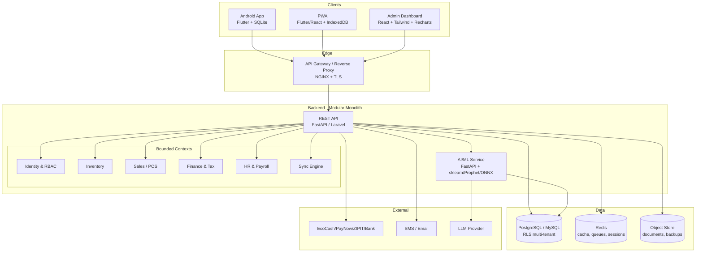
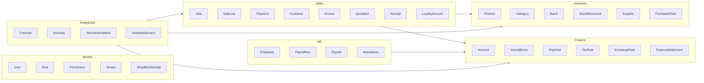
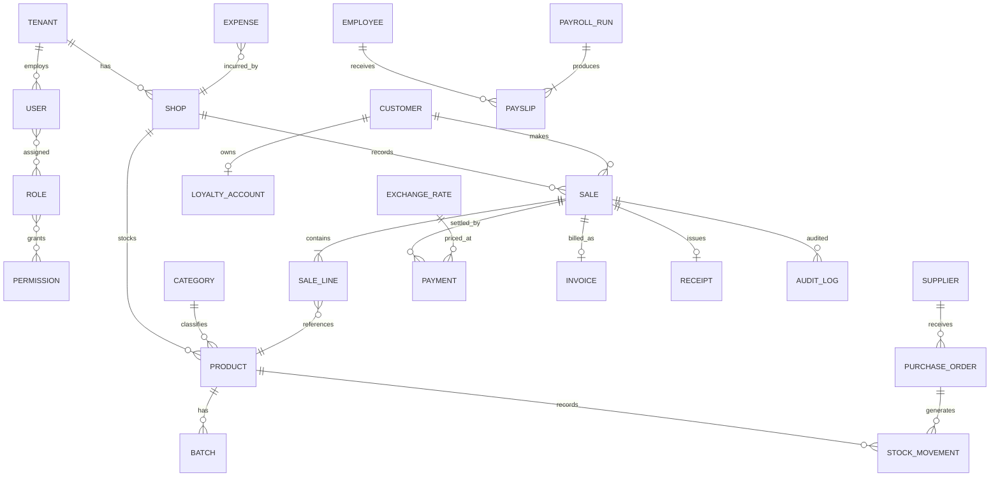
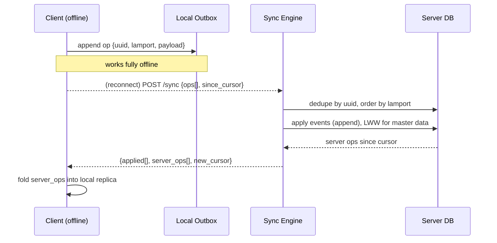
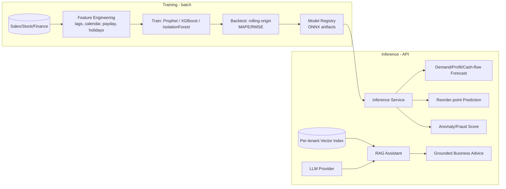
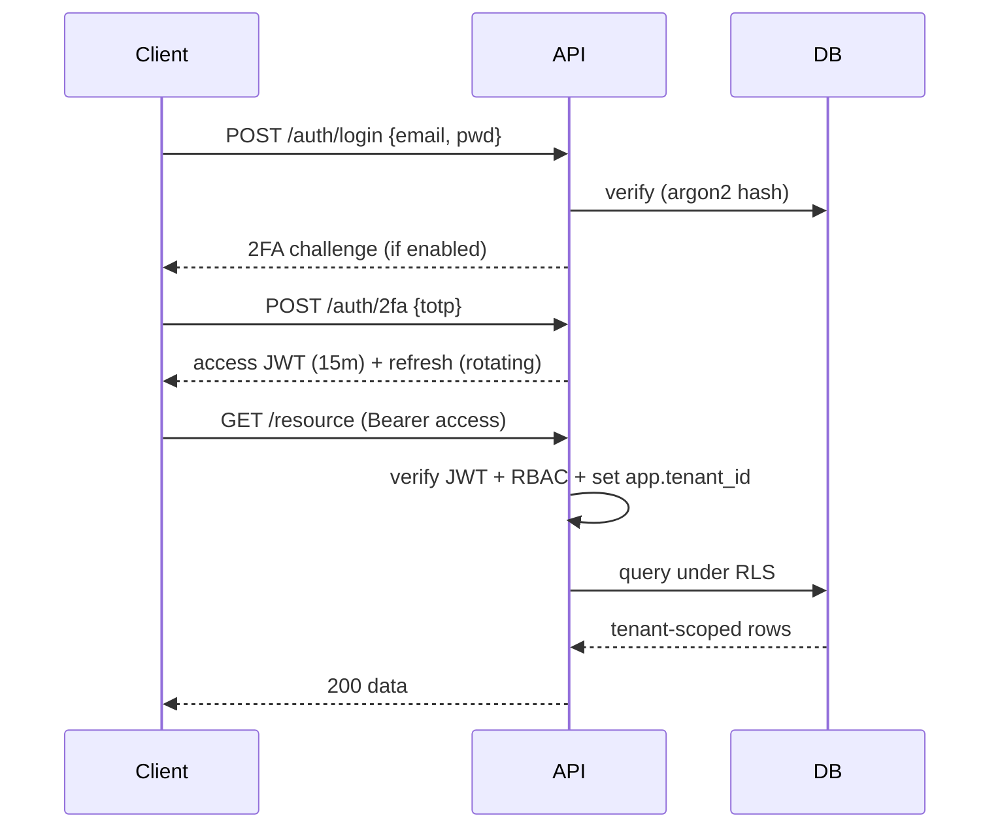
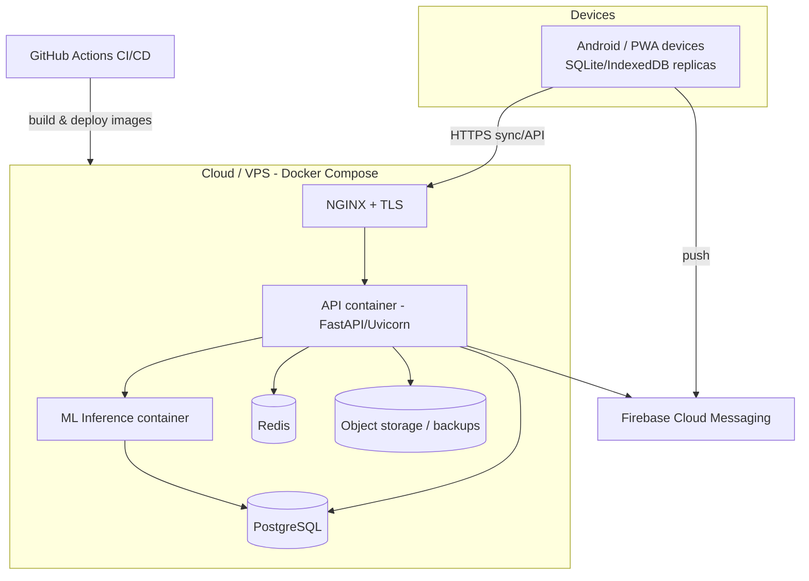

# Chapter 4 — System Design & Architecture

## 4.1 Introduction

This chapter translates the requirements of Chapter 3 into a concrete design. It presents the architectural style and rationale, the technology stack, the logical component decomposition, the data model (with normalisation and the transaction-time multi-currency design), the offline-first synchronisation mechanism, the AI/ML subsystem design, security design, and the standard engineering diagrams (class, sequence, ER, deployment). The design adheres to the enterprise principles surveyed in Chapter 2 — layered/hexagonal architecture [15], [17], DDD bounded contexts [16] and the twelve-factor methodology [18].

## 4.2 Architectural Overview

SIMS AI is a **client-authoritative, offline-first, modular system** with four client surfaces (Android app, PWA, web admin dashboard, and third-party API consumers) over a shared REST/OpenAPI backend, a relational data tier, and an ML/AI service. The backend is a **modular monolith** internally partitioned into DDD bounded contexts, deployable as containers and extractable into services (notably ML inference) under load.



### 4.2.1 Architectural Style Rationale

- **Hexagonal (Ports & Adapters):** domain logic depends only on ports; adapters implement payment, SMS, email, storage and LLM providers. This satisfies NFR10 (interoperability) and makes providers swappable and testable [17].
- **Modular monolith over microservices:** at the study's scale, a monolith minimises operational complexity while DDD boundaries preserve modularity and a future extraction path [19] — matching NFR7.
- **Client-authoritative offline-first:** clients own a full local dataset and operate without the network, satisfying NFR1/NFR6.

## 4.3 Technology Stack and Justification

| Layer | Technology | Justification |
|---|---|---|
| Mobile & PWA | **Flutter (Dart)**; optional **Kotlin** native modules | Single codebase → Android + PWA; high-fidelity UI, animations; native modules for camera/barcode where needed |
| Web dashboard | **React + TypeScript + Tailwind CSS + Chart.js/Recharts** | Component ecosystem, premium responsive UI, interactive charts (FR13) |
| API backend | **FastAPI (Python)** primary; **Laravel (PHP)** documented alternative | FastAPI: async, auto-OpenAPI, same language as ML; Laravel available where PHP hosting is preferred |
| Datastore | **PostgreSQL** primary (RLS, window functions, `NUMERIC`); **MySQL** supported | Financial-grade numeric types and row-level security for multi-tenancy (§2.3) |
| Cache/Queue | **Redis** | Sessions, rate-limiting, background jobs (report/PDF/SMS) |
| Local store | **SQLite** (mobile), **IndexedDB** (PWA) | Embedded, transactional local persistence for offline-first |
| ML | **scikit-learn, Prophet, XGBoost**; **TensorFlow/PyTorch** for advanced models; **ONNX** for portable inference; **OpenCV** for barcode/vision | Lightweight models for short series (§2.5); ONNX decouples training from serving |
| AI assistant | **LLM provider via RAG** | Grounded natural-language business advice (§2.6) |
| Auth | **JWT (RFC 7519)** + **TOTP 2FA (RFC 6238)** | Stateless auth, MFA (NFR4) |
| Infra | **Docker / Docker Compose**, **NGINX**, **Firebase** (push/optional auth), **GitHub Actions CI** | Reproducible, twelve-factor deployment; CI/CD |

## 4.4 Domain Model and Bounded Contexts



## 4.5 Data Design

### 4.5.1 Normalisation

The schema is normalised to **Third Normal Form (3NF)**: every non-key attribute is fully functionally dependent on the whole primary key and on nothing but the key, eliminating insertion, update and deletion anomalies [15]. Selected, deliberate denormalisations are introduced only for read-heavy analytics (materialised views / summary tables for dashboards), documented as such, keeping the transactional core in 3NF.

### 4.5.2 Multi-Currency: Transaction-Time Capture (a core contribution)

The defining data-design decision addresses RQ3. Rather than tagging a transaction with only a currency label, every monetary event persists **(amount, currency, base_currency, exchange_rate, rate_source, captured_at)**. Amounts are stored as exact `NUMERIC(18,4)` (never floating point). A single `exchange_rates` table records time-stamped rates per currency pair and source (official / interbank / parallel-market where recorded). This guarantees that a sale made at a given ZiG/USD rate remains economically interpretable months later regardless of subsequent devaluation — the property missing from conventional ERPs (§2.8). All reporting converts to a chosen reporting currency using the rate *as at* the transaction, not today's rate.

### 4.5.3 Multi-Tenancy and Auditing

Every business-owned row carries a non-null `tenant_id`; **PostgreSQL Row-Level Security** enforces tenant isolation at the database layer, defence-in-depth against application bugs. An append-only `audit_log` records actor, action, entity, before/after snapshot and timestamp for every state change (FR11), and immutable `stock_movement` and `journal_entry` ledgers make inventory and finance event-sourced and reconstructable.

### 4.5.4 Entity-Relationship Diagram (core, abridged)



### 4.5.5 Key Table Sketch (illustrative DDL, PostgreSQL)

```sql
CREATE TABLE sale (
    id            UUID PRIMARY KEY,            -- client-generated for idempotent sync
    tenant_id     UUID NOT NULL,
    shop_id       UUID NOT NULL,
    customer_id   UUID,
    cashier_id    UUID NOT NULL,
    subtotal      NUMERIC(18,4) NOT NULL,
    tax_amount    NUMERIC(18,4) NOT NULL,
    total         NUMERIC(18,4) NOT NULL,
    currency      CHAR(3) NOT NULL,            -- e.g. 'USD','ZWG'
    base_currency CHAR(3) NOT NULL,
    exchange_rate NUMERIC(18,6) NOT NULL,      -- rate at capture
    rate_source   TEXT NOT NULL,
    status        TEXT NOT NULL,               -- draft|committed|synced|void
    captured_at   TIMESTAMPTZ NOT NULL,        -- device time of sale
    synced_at     TIMESTAMPTZ,
    lamport_clock BIGINT NOT NULL              -- for merge ordering
);
ALTER TABLE sale ENABLE ROW LEVEL SECURITY;
CREATE POLICY tenant_isolation ON sale
    USING (tenant_id = current_setting('app.tenant_id')::uuid);
```

## 4.6 Offline-First Synchronisation Design (a core contribution)

This design answers RQ2/RQ3 and hypothesis H1. Each client holds a full SQLite/IndexedDB replica and appends every mutation to a local **outbox** as an operation with a client-generated UUID and a **Lamport clock** [22]. Business entities are engineered so that reconciliation is safe:

- **Immutable events** (sales, payments, stock movements, journal entries) are *append-only*; merging two replicas is the union of their event sets, deduplicated by UUID (idempotency [24]). Stock-on-hand is a *derived* fold over movements, so it can never be "lost" in a conflict.
- **Mutable master data** (product name/price, customer details) uses **last-writer-wins** keyed on the Lamport clock, with conflicts surfaced in an audit trail for review.



Delta synchronisation (cursor-based, only changes since last sync) minimises data transfer over expensive mobile data (NFR3). Idempotent application guarantees "no lost or double-counted sales" (NFR6), the correctness property the financial domain demands.

## 4.7 AI/ML Subsystem Design



- **Forecasting (FR14):** Prophet/XGBoost per product or category; reorder point = f(forecast demand over lead time, safety stock, service level) [28].
- **Anomaly/fraud (FR15):** Isolation Forest [7] over transaction features (discount %, void frequency, time-of-day, cash variance) producing a review queue rather than hard blocks.
- **AI assistant (FR16):** RAG [8] retrieves the tenant's own figures into the prompt, enforcing tenant isolation at retrieval; the LLM explains, never invents, the numbers.
- **Serving:** models exported to **ONNX** decouple Python training from lightweight inference; TensorFlow/PyTorch reserved for future advanced models.

## 4.8 Security Design

Defence-in-depth (§2.7): TLS in transit; encryption at rest (database + object store); **JWT** short-lived access + rotating refresh tokens [34]; **TOTP 2FA** [35]; RBAC enforced at API and DB (RLS); OWASP Top-Ten mitigations — parameterised queries/ORM (injection), server-side authorisation checks (broken access control), output encoding, rate-limiting, secrets in environment (twelve-factor) [18], [33]. Every mutation is audit-logged (FR11). Backups are encrypted; the design conforms to the Cyber and Data Protection Act (Ch. 12:07) [36].



## 4.9 UI/UX Design

The interface targets NFR5: a mobile-first, icon-led, low-literacy-friendly design with large touch targets, minimal text entry (barcode scan over typing), immediate visual feedback, smooth animations, dark mode (FR24) and a premium, ERP-grade aesthetic built on a consistent design system (Tailwind tokens; Material components in Flutter). Dashboards present KPI widgets, interactive charts (Chart.js/Recharts) and AI insight cards. A bilingual-ready copy layer accommodates English and local languages.

## 4.10 Deployment Architecture



Twelve-factor practices [18] (config via environment, stateless API, disposable containers, backing services as attached resources) make the deployment reproducible and horizontally scalable (NFR3). CI/CD via GitHub Actions builds, tests and ships container images.

## 4.11 Chapter Summary

This chapter defined SIMS AI's hexagonal, modular, offline-first architecture; justified the technology stack; presented the DDD domain model; designed a 3NF, multi-tenant schema with the transaction-time multi-currency model and immutable ledgers; specified the idempotent, Lamport-ordered synchronisation engine; designed the ML/RAG subsystem; and set out the security, UX and deployment designs, each traced to requirements and to the literature. Chapter 5 describes how this design was implemented.
