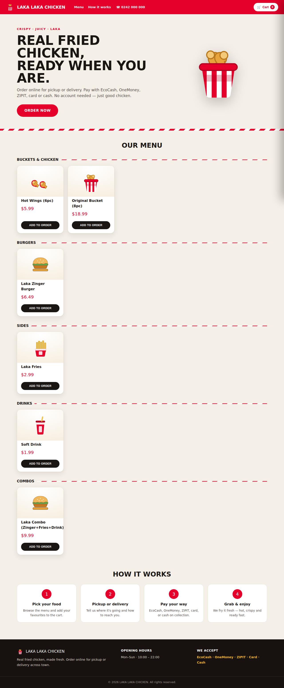
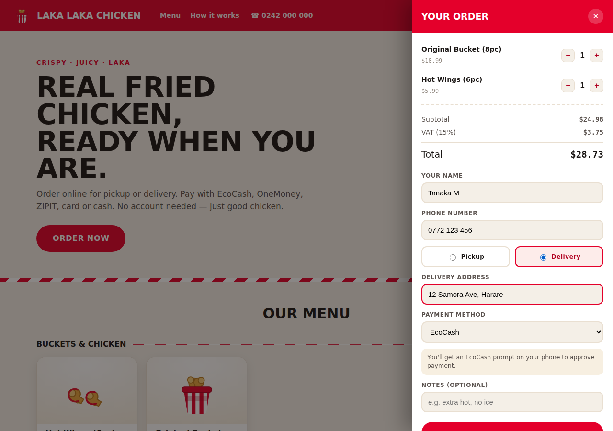
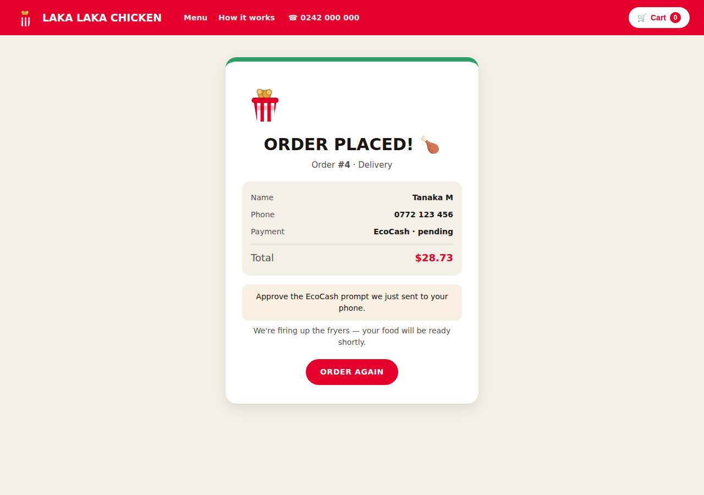
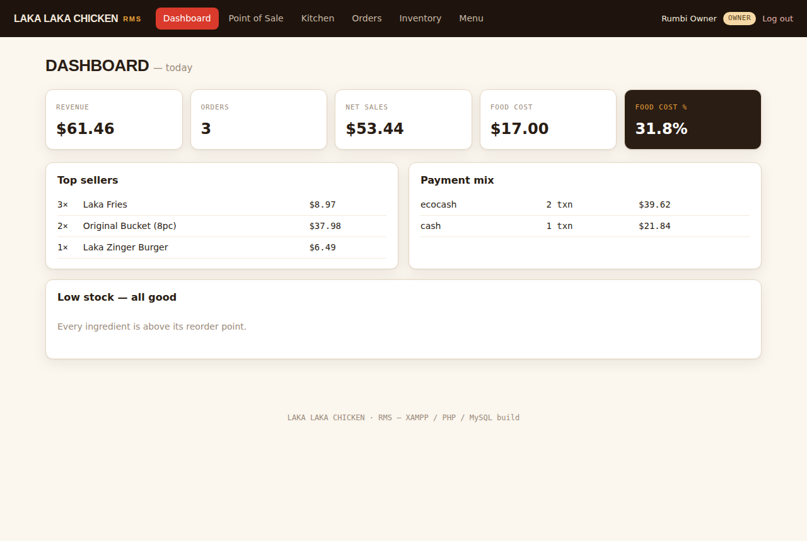
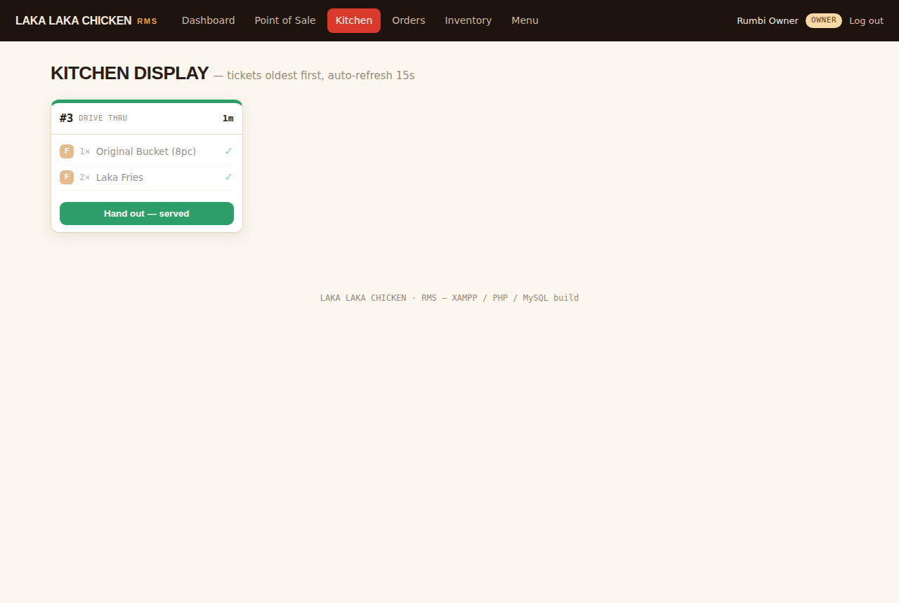

# 🍗 LAKA LAKA CHICKEN — RMS (XAMPP / PHP / MySQL)

A working **fast-food restaurant** website + management system built on the
classic **XAMPP** stack — Apache + MySQL/MariaDB + PHP, with the database
managed through **phpMyAdmin**. There are two sides:

- a **public customer storefront** (`index.php`) — **no login** — where
  customers browse the menu, add to cart, choose pickup or delivery, and pay
  with EcoCash, OneMoney, ZIPIT, card or cash; and
- a **staff back office** (POS, kitchen display, dashboard, inventory) behind
  a private staff sign-in.



## The customer storefront (public — no account)

`index.php` is the website customers see. It never mentions staff or login.
They browse the menu, build a cart in a slide-in drawer, enter their name +
phone, choose **pickup or delivery**, pick a **payment method**, and place the
order. Every price, VAT and total is computed **server-side**, and the order
flows straight into the kitchen and inventory like any other sale — captured
with the customer's details and payment status.



## Staff back office

Staff sign in at **`staff.php`** — a private URL that is **not linked from the
public site**. Role-based access is enforced on every page (a cashier hitting
the dashboard gets a 403).

| Page | Who | What it does |
|---|---|---|
| **Point of Sale** (`pos.php`) | cashier, manager, owner | Tap menu tiles → live cart with VAT → pick channel & payment → charge. On charge it writes the order, routes each item to its kitchen station, **depletes ingredients via the recipe**, and records the payment — all in one SQL transaction. |
| **Kitchen Display** (`kitchen.php`) | cook, manager, owner | Live ticket board, oldest first, colour-coded by age. **Bump** each item ready; when all are ready, hand the order out. Auto-refreshes every 15 s. Online customer orders appear here automatically. |
| **Dashboard** (`dashboard.php`) | manager, owner | Today's revenue, orders, net sales, **food-cost %**, top sellers, payment mix and low-stock alerts — all computed live from the database. |
| **Inventory** (`inventory.php`) | manager, owner | Stock on hand, reorder points, stock value; restock an ingredient (writes a stock movement). |
| **Menu** (`menu.php`) | manager, owner | Edit prices inline and **86** an item (pull it from every channel instantly). |
| **Orders** (`orders.php`) | cashier, manager, owner | History of the last 100 orders — including online orders with the **customer's name, phone and pickup/delivery** and payment status. |

## Database

Everything lives in one MySQL database, **`laka_laka_chicken`** — 10 tables:
`users`, `categories`, `menu_items`, `ingredients`, `recipes`, `orders`,
`order_items`, `payments`, `stock_movements`, `audit_log`. Money is stored as
`DECIMAL(18,4)`; every order captures its currency and exchange rate; orders
and stock movements are append-only ledgers. Online orders also store the
customer's name, phone, pickup/delivery choice, address and payment status.
Full schema + seed data: [`sql/laka_laka_chicken.sql`](sql/laka_laka_chicken.sql).

## Setup with XAMPP (5 steps)

1. **Install XAMPP** and open the **XAMPP Control Panel**. Start **Apache**
   and **MySQL**.
2. **Copy this folder** into XAMPP's web root and name it `laka-pos`:
   - Windows: `C:\xampp\htdocs\laka-pos`
   - macOS: `/Applications/XAMPP/htdocs/laka-pos`
   - Linux: `/opt/lampp/htdocs/laka-pos`
3. **Create the database.** Open <http://localhost/phpmyadmin> →
   **Import** → choose `sql/laka_laka_chicken.sql` → **Go**. This creates the
   `laka_laka_chicken` database, all tables and demo data in one shot.
4. **Check the connection settings** in [`config/db.php`](config/db.php). The
   defaults match a stock XAMPP install (`root` / empty password on
   `127.0.0.1:3306`) — change them only if you've secured MySQL differently.
5. **Open the customer site:** <http://localhost/laka-pos/> — browse and
   order, no account needed.
6. **Staff sign-in (private):** <http://localhost/laka-pos/staff.php> — this
   URL is intentionally not linked from the customer site.

### Staff demo logins

| Role | Username | Password | Lands on |
|---|---|---|---|
| Owner | `owner` | `owner123` | Dashboard |
| Manager | `manager` | `manager123` | Dashboard |
| Cashier | `cashier` | `cashier123` | Point of Sale |
| Cook | `cook` | `cook123` | Kitchen Display |

> Passwords are stored as bcrypt hashes and checked with PHP's
> `password_verify()` — the seed hashes in the SQL already match the
> passwords above.

## Screenshots

| Customer checkout | Order confirmation |
|---|---|
|  |  |

| Owner dashboard | Kitchen display |
|---|---|
|  |  |

## Folder layout

```
laka-pos/
├── index.php            # PUBLIC customer storefront (no login)
├── staff.php            # private staff sign-in (unlinked)
├── logout.php
├── pos.php              # point of sale
├── kitchen.php          # kitchen display + bump bar
├── dashboard.php        # owner/manager KPIs
├── inventory.php        # stock + restock
├── menu.php             # price edit + 86
├── orders.php           # order history (incl. online customers)
├── config/db.php        # PDO connection + VAT rate + food icons
├── includes/            # auth, header, footer
├── assets/style.css     # branded stylesheet
├── assets/food/         # original SVG food illustrations
├── sql/
│   └── laka_laka_chicken.sql   # <-- import this in phpMyAdmin
└── docs/                # screenshots
```

## Notes

- **No Composer, no build step.** Plain PHP (PDO) + one SQL file — it runs on
  any XAMPP install out of the box.
- Prices, VAT (15%) and totals are always computed **server-side** so a
  tampered client can't set its own price.
- The whole checkout — order, kitchen tickets, inventory depletion and
  payment — runs inside a single database transaction, so a failure rolls
  back cleanly and never half-writes a sale.
