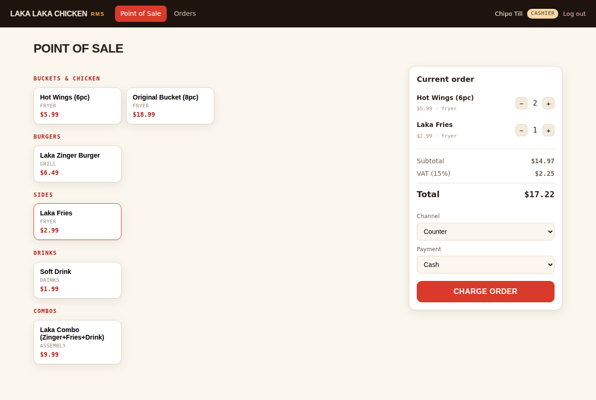

# 🍗 LAKA LAKA CHICKEN — RMS (XAMPP / PHP / MySQL)

A working **fast-food restaurant management system** built on the classic
**XAMPP** stack — Apache + MySQL/MariaDB + PHP, with the database managed
through **phpMyAdmin**. It's the runnable implementation of the LAKA LAKA
CHICKEN system design: point of sale, kitchen display, recipe-linked
inventory, and an owner dashboard, all backed by a real SQL database.



## What's inside

| Page | Who | What it does |
|---|---|---|
| **Point of Sale** (`pos.php`) | cashier, manager, owner | Tap menu tiles → live cart with VAT → pick channel & payment → charge. On charge it writes the order, routes each item to its kitchen station, **depletes ingredients via the recipe**, and records the payment — all in one SQL transaction. |
| **Kitchen Display** (`kitchen.php`) | cook, manager, owner | Live ticket board, oldest first, colour-coded by age. **Bump** each item ready; when all are ready, hand the order out. Auto-refreshes every 15 s. |
| **Dashboard** (`dashboard.php`) | manager, owner | Today's revenue, orders, net sales, **food-cost %**, top sellers, payment mix and low-stock alerts — all computed live from the database. |
| **Inventory** (`inventory.php`) | manager, owner | Stock on hand, reorder points, stock value; restock an ingredient (writes a stock movement). |
| **Menu** (`menu.php`) | manager, owner | Edit prices inline and **86** an item (pull it from every channel instantly). |
| **Orders** (`orders.php`) | cashier, manager, owner | Searchable history of the last 100 orders with items, cashier, payment and status. |

Role-based access is enforced on every page (a cashier hitting the dashboard
gets a 403).

## Database

Everything lives in one MySQL database, **`laka_laka_chicken`** — 10 tables:
`users`, `categories`, `menu_items`, `ingredients`, `recipes`, `orders`,
`order_items`, `payments`, `stock_movements`, `audit_log`. Money is stored as
`DECIMAL(18,4)`; every order captures its currency and exchange rate; orders
and stock movements are append-only ledgers. Full schema + seed data:
[`sql/laka_laka_chicken.sql`](sql/laka_laka_chicken.sql).

## Setup with XAMPP (5 steps)

1. **Install XAMPP** and open the **XAMPP Control Panel**. Start **Apache**
   and **MySQL**.
2. **Copy this folder** into XAMPP's web root and name it `laka-pos`:
   - Windows: `C:\xampp\htdocs\laka-pos`
   - macOS: `/Applications/XAMPP/htdocs/laka-pos`
   - Linux: `/opt/lampp/htdocs/laka-pos`
3. **Create the database.** Open <http://localhost/phpmyadmin> →
   **Import** → choose `sql/laka_laka_chicken.sql` → **Go**. This creates the
   `laka_laka_chicken` database, all tables and demo data in one shot.
4. **Check the connection settings** in [`config/db.php`](config/db.php). The
   defaults match a stock XAMPP install (`root` / empty password on
   `127.0.0.1:3306`) — change them only if you've secured MySQL differently.
5. **Open the app:** <http://localhost/laka-pos/> and sign in.

### Demo logins

| Role | Username | Password | Lands on |
|---|---|---|---|
| Owner | `owner` | `owner123` | Dashboard |
| Manager | `manager` | `manager123` | Dashboard |
| Cashier | `cashier` | `cashier123` | Point of Sale |
| Cook | `cook` | `cook123` | Kitchen Display |

> Passwords are stored as bcrypt hashes and checked with PHP's
> `password_verify()` — the seed hashes in the SQL already match the
> passwords above.

## Screenshots

| Owner dashboard | Kitchen display |
|---|---|
|  |  |

## Folder layout

```
laka-pos/
├── index.php            # login (router by role)
├── logout.php
├── pos.php              # point of sale
├── kitchen.php          # kitchen display + bump bar
├── dashboard.php        # owner/manager KPIs
├── inventory.php        # stock + restock
├── menu.php             # price edit + 86
├── orders.php           # order history
├── config/db.php        # PDO connection + VAT rate
├── includes/            # auth, header, footer
├── assets/style.css     # branded stylesheet
├── sql/
│   └── laka_laka_chicken.sql   # <-- import this in phpMyAdmin
└── docs/                # screenshots
```

## Notes

- **No Composer, no build step.** Plain PHP (PDO) + one SQL file — it runs on
  any XAMPP install out of the box.
- Prices, VAT (15%) and totals are always computed **server-side** so a
  tampered client can't set its own price.
- The whole checkout — order, kitchen tickets, inventory depletion and
  payment — runs inside a single database transaction, so a failure rolls
  back cleanly and never half-writes a sale.
